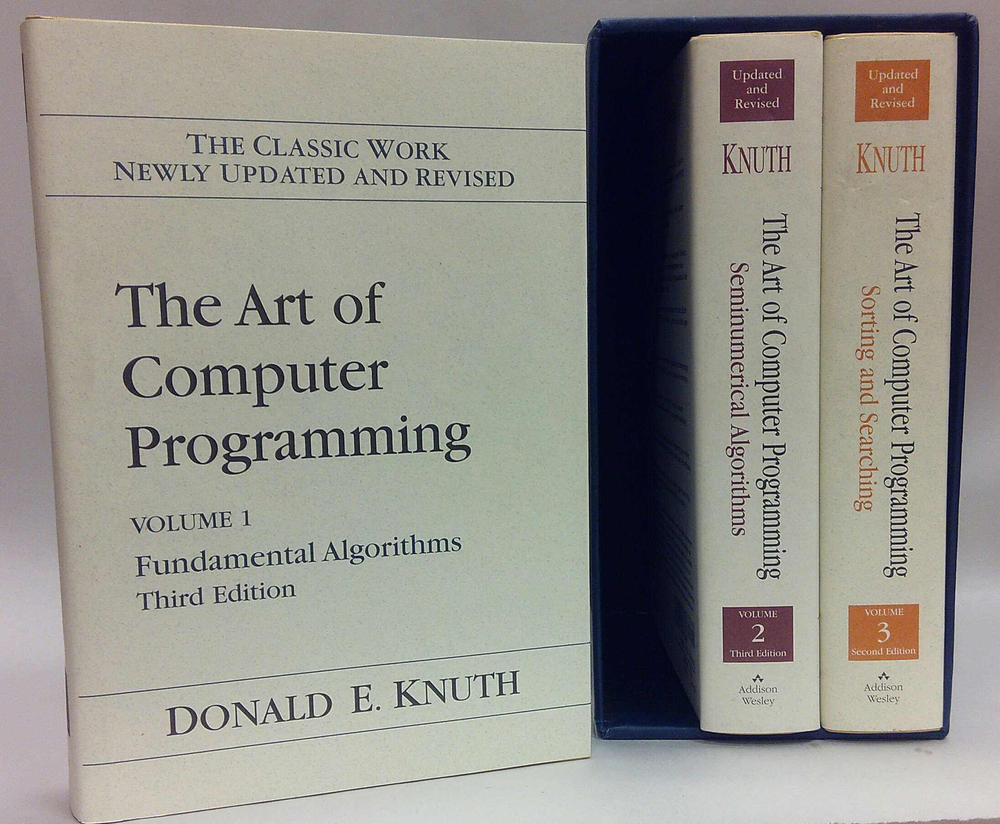
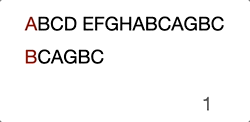
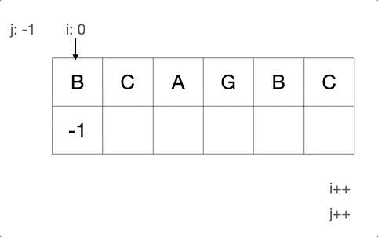

String matching is a very fundamental task for computer. We've seen many programs that allow you to pop out the search box via <kbd>Ctrl + F</kbd> / <kbd>Cmd + F</kbd>.


For example, we could check if there's a string of "search" from "I'm searching on Google". 
There're many algorithms that could help you achieve this function. Knuth-Morris-Pratt (as known as "KMP") is one of them (See also Rabin-Karp, Boyer-Moore).

This algorithm is named after the 3 inventors. 
I bet you've heard of this book 
[The art of computer programming](https://www.google.com/url?sa=t&rct=j&q=&esrc=s&source=web&cd=&ved=2ahUKEwierP6Fqbz4AhVDMXAKHc6vBFoQFnoECAsQAQ&url=https://en.wikipedia.org/wiki/The_Art_of_Computer_Programming&usg=AOvVaw0ZT6UiIjWJEf_Zv9NHZ_jp). 



The author of this book [Donald Knuth](https://en.wikipedia.org/wiki/Donald_Knuth) (The famous comupter scientist) is one of the inventors of this algorithm. 
(I haven't read his book yet but let me pay my best tribute to this great scientist)

This algorithm was so difficult to me to understand until I found these 2 following articles from Google search.

- [https://www.w3spot.com/2020/07/kmp-algorithm-explained-in-plain-english.html](https://www.w3spot.com/2020/07/kmp-algorithm-explained-in-plain-english.html)
- [https://www.baeldung.com/cs/knuth-morris-pratt](https://www.baeldung.com/cs/knuth-morris-pratt)

Now I wanna try to explain this amazing algorithm in my own language coz any day in the future I might need to go over this amazing creation.

## The bruteforce issue

Suppose we have a string of 

> "ABCD EFGHABCAGBC" (haystack) 

and a match string of 

> "BCAGBC" (needle)

We might have a bruteforce solution by comparing each of the characters in both haystack and needle as below.

1. First character not match, move to next position

> ABCD EFGHABCAGBC
>
> ^
>
> BCAGBC

2. First character "B" matched
> ABCD EFGHABCAGBC
>
> ..^
>
> ..BCAGBC


3. Second character "C" matched
> ABCD EFGHABCAGBC
>
> .....^
>
> ..BCAGBC


4. Thrid character not match, move pointer to next needle character
> ABCD EFGHABCAGBC
>
> .......^
>
> ..BCAGBC


5. First character not matched, move needle head to next haystack character
> ABCD EFGHABCAGBC
>
> .....^
>
> .....BCAGBC

Then it goes on with the previous steps… Just take a look at the GIF below, this will make you further understand it intuitively.


Now you see the problem, right? It's not efficient because we're trying to move the search position to the already compared position.

When we compared "D" with "A" at step 4, we already know that the current haystack characters are "BCD" and even we move to the next haystack postion character "C" it will obviously fail the attempt.

Thus, we need a good strategy to save us from comparing characters from the already "checked" positions.
## How does the KMP magic take effect?
Actually KMP does nothing special, apart of checking the next character it'll just do the following.
> Reuse the known information

How?

Let's flashback to step 4 when it tries to compare "D" with "C". Instead of aligning the head character of "BCC" with next haystack character "C", KMP will skip comparing the character "C" and move it to a later position.

To achieve this, KMP also has to generate a "Partial Match Table" according to the needle string. In our case, the table may look like this.

| B   | C   | A   | G   | B   | C   |
|-----|-----|-----|-----|-----|-----|
| -1  | 0   | 0   | 0   | 1   | 2   |

(Note: Usually we set the first value of the "Partial Match Table" to -1 for programming convenience)

To know how this table is generated, we need to understand the following terms first
- **prefix collection**: All combinations of the needle string excluding the last character
- **suffix collection**:  All conbimations of the needle string exlucding the first character
- **partial match value**: The longest element length of the union of prefix collection and suffix collection

Then, we'll evaluate each "partial match string's" value
- "B"
  - prefix collection: Null
  - suffix collection: Null
  - collection union: Null
  - partial match value: 0

- "BC"
  - prefix collection: [B]
  - suffix collection: [C]
  - collection union: null
  - partial match value: 0

- "BCA"
  - prefix collection: [B, BC]
  - suffix collection: [CA, A]
  - collection union: null
  - partial match value: 0

- "BCAG"
  - prefix collection: [B, BC, BCA]
  - suffix collection: [CAG, CA, C]
  - collection union: null
  - partial match value: 0

- "BCAGB"
  - prefix collection: [B, BC, BCA, BCAG]
  - suffix collection: [CAGB, AGB, GB, B]
  - collection union: [B]
  - partial match value: 1

- "BCAGBC"
  - prefix collection: [B, BC, BCA, BCAG, BCAGB]
  - suffix collection: [CAGBC, AGBC, GBC, BC, C]
  - collection union: [BC]
  - partial match value: 2

Okay, let's continue the case in this article, step 4 -> matching "D" and "A".

> ABCD EFGHABCAGBC
>
> .......^
>
> ..BCAGBC

Well, the result is false, we will need to move the needle's position by 2. You will be needing the following formula to calculate the "positions to move"

> positions to move = matched count - partial match value

In this case, we've already matched 2 characters "B" and "C". The "partial match value" under character "A" is 0. Thus, we have to move 2 characters which aligned "D" and "B" in the same comparing position.

> ABCD EFGHABCAGBC
>
> .......^
>
> .......BCAGBC

(Skip the ones in the middle "EFGHA")
We found the head character match, there'll be another around of comparison until the end.

> ABCD EFGHABCAGBC
>
> .......................^..........^
>
> .......................BCAGBC

Here is the intuitive GIF to help you understand if better.



## Actual code (Bruteforce)

Before we dive into the KMP solution, let's take a look at how we usually implement it "bruteforcely".

```c
int bruteforce(char *haystack, char *needle)
{
	int i = 0,
		j = 0;
	int h_len = strlen(haystack);
	int n_len = strlen(needle);

	// When needle is an empty string, always return 0.
	if (n_len == 0) return 0;

	// Until i,j reaches the end of each string
	while (h_len > i && n_len > j)
	{
		// Aggregate i,j when there's a match
		if (haystack[i] == needle[j])
		{
			i++;
			j++;
		}
		else
		{
			// NOTE: This never efficient
			// Jump to the next character of which doesn't match
			i = i - j +1;
			// Jump to needle head
			j = 0;
		}
	}

	// Once the while loop finishes, j should equal to needle length if there's any match
	if (j == n_len) {
		return i - j;
	}

	return -1;
}
```

## Actual code (KMP)

The coding will be separated into 2 parts:
1. next array (partial match table)
2. main iteration

### 1. Next array

Next array may appear very different to the explanation of the "prefix and suffix" thing. But indeed, the implementation used some tricks to make the time complexity stay as linear. In a simple word:

>To match the needle string using itself

Note: Make sure to debug it so that you could fully understand how this amazing code works.

Alternatively, the blow GIF will help you out if you're lazy for debugging.



```c
int *get_next(char *needle, int len)
{
	int i = 0,
		j = -1;
	// Allocate a space of heap memory to store the "partial match table"
	int *next = (int *)calloc(len, sizeof(int));

	// Make the first element -1 for convenience
	next[0] = -1;

	// Until j reaches the end of needle
	while (len > j) {
		if (j == -1 || needle[i] == needle[j])
		{
			++i;
			++j;
			// j works as an accumulator. It gives you the number of how many
			// characters has matched
			next[i] = j;
		}
		else
		{
			j = next[j];
		}
	}

	// Caller will free the heap memory
	return next;
}
```
### 2. Main iteration

The main part of KMP is almost the same to building the "next array". As the whole algorithm is actually a format of ["finite-state machine"](https://en.wikipedia.org/wiki/Finite-state_machine).

```c
int kmp(char *haystack, char *needle)
{
	int i = 0,
		j = 0;
	int h_len = strlen(haystack);
	int n_len = strlen(needle);

	// When needle is an empty string, always return 0.
	if (n_len == 0) return 0;

	// get "Partial Match Table" as next
	int *next = get_next(needle, n_len);

	// Until i,j reaches the end of each string
	while (h_len > i && n_len > j)
	{
		// Aggregate i,j only when
		//   1. j == needle[0] == -1, this means there's no succesful match, need to restart at a new position
		//   2. Same character appeared in both haystack and needle
		if (j == -1 || haystack[i] == needle[j])
		{
			i++;
			j++;
		}
		else
		{
			// Assign the "Partial Match Table" value
			j = next[j];
		}
	}

	// (Don't forget to free the heap memory)
	free(next);

	// Once the while loop finishes, j should equal to needle length if there's any match
	if (j == n_len) {
		return i - j;
	}

	return -1;
}
```

## In the end
Honestly, the KMP algorithm is still very much confusing to me especially the reason why they implemented that way. 
But it truly proves an excellent methodology of solving a "patternish" problem.
The KMP algorithm is not the most efficient algorithm compared to "Boyer Moore" and "Rabin-Karp". 
Most of our editors "find" function adopts "Boyer Moore" algorithm. I'll write another article to explain it.


