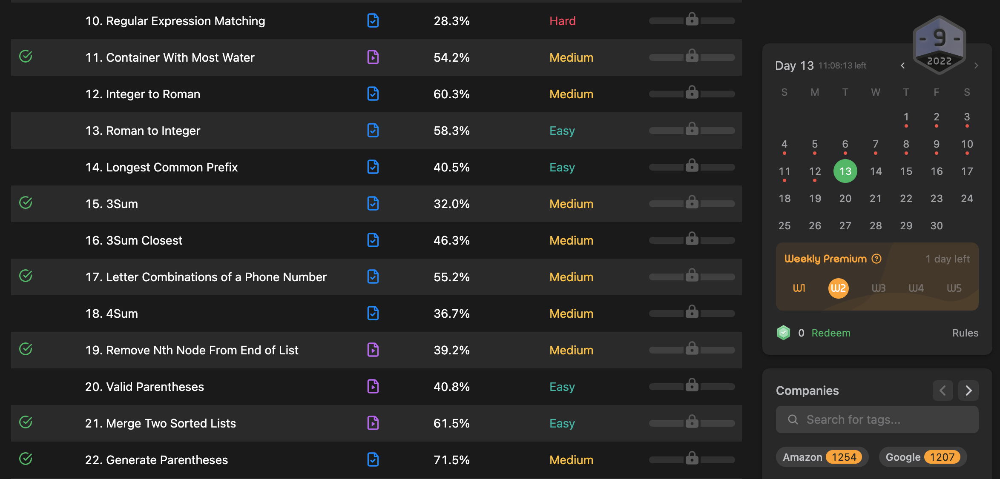

I started using [leetcode.com](https://leetcode.com) since 2016 and solved quite a lot of easy problems using Python. There were many solutions on [leetcode.com](leetcode.com) with only one line of Python code back then. It felt very cool and I took some time practice a lot mimicking that "one-liner" for solving those problems.

But apparently in the end, it didn't help me acquire any actual algorithm knowledge. My goal of doing "leetcode" that time was completely out for curiocity. What a waste of time…

Well, just about a few months ago, I restarted my algorithm self-learning with [Leetcode Algorithm Study Plan](https://leetcode.com/study-plan/algorithm/). I felt very content with what I have been through even the "tight" schedule of this plan had me work my ass off late after work. 

As a result, the study plan got me more familiar with some very popular algorithms like backtrack / dynamic programming etc and also data structures like binary tree / linked list which I hardly ever used in my projects.

These weeks of studying really helped me fill the bucket of my wishes. Thus, in this article I'll share my thoughts and ideas of teaching yourself algorithm online.

# What's in the "Leetcode Algorithm Study Plan"?

Well, these days there're many online courses or leetcode notes that are telling us how to get started with learning algorithm by leetcode quetions. Of course, I did some research and tried their so-called "optimal" study material. They were all great and providing clear solutions to their algorithm problems.

I found these study materials all have one thing in common:

> They list out the algorithm patterns.

This is also what the [Leetcode Algorithm Study Plan](https://leetcode.com/study-plan/algorithm/) does to their training program. The problems are separated into different sections where each of them is under one algorithm pattern.
- Binary Search
- Two Pointers
- Sliding Window
- BFS / DFS
- Backtracking
- Dynamic Programing
- etc.

Our mission here is to complete the given daily tasks. By the end of the study plan day, all of the problems must have turned into "completed". Otherwise, we'll have to start from the first question again (Don't ask me why I know it… Well, that was a sad story…).

Leetcode offers 3 algorithm study plans ordered by difficuties:
* Algorithm I (free): 14 days
* Algorithm II (free): 21 days
* Algorithm III (paid): 28 days

The first 2 are free but the 3rd one needs subscription. After 14 + 21 days of study, I was still not sure if I should continue with Leetcode. I dropped it and bought 1 year subscription of Algoexpert.io simply because it has a dark theme. (Leetcode's experience is also quite good but my eyes now are very picky)

# What I have learned

The 35 days study was sometimes like riding roller coaster and sometimes among the big waves. There're averagely 2-3 problems each day. And there's always one question that's baking my noodles very badly.

My eago and curiosity always tried to drive me to open the solutions page and look at how other amazing developers solve the problem. There're so many novel solutions that I think a normal person can never come up with. This made me very anxious during solving the problem. And even sometimes I felt myself being very incredibly stupid.

So I did quite a lot of search about how other developers approach their algorithm problems. The answers are such a relief and made me calm down quite a lot. In the later days of that study plan, I found myself getting into a rather appropriate rythm so that I could complete those problems peacefully on time.

If you had any concerns while doing the Leetcode problems, simply look at the tips below. Hope you may find them helpful.

## Are 2 or 3 problems enough for a day?

I think it depends, but usually 3 problems are enough for me because I'm treating them as learning new things. So it'll take me some more time to ingest and digest the knowledge points.

Don't worry the speed but instead, worry about whether you get a further understanding over that knowledge point or not.

During these 5 weeks, I also pushed my solutions (using Javascript) to [Github repo](https://github.com/daiyanze/algo-js) so that I could always take a look at my solutions any time for a quick knowledge point review.

## I could only workout brute-force solutions

This is very common thing for those who don't have a lot of experience on algorithm. It was tough for me to workout a rather optimized solution from beginning. Almost all of the answers I submitted to Leetcode were just some nested for loops which was far behind correct ones.

Here are some answers from Quora, people are event allowed to approach a problem with brute-force during interviews.

[https://www.quora.com/Can-I-use-the-brute-force-approach-to-solve-algorithm-questions-in-the-technical-interview](https://www.quora.com/Can-I-use-the-brute-force-approach-to-solve-algorithm-questions-in-the-technical-interview)

Brute-force solutions aren't that bad, they are good references for us to move on for finding the optimal solutions.

## How exactly should I approach Leetcode problems?

There're certain patterns for each type of algorithm problems. If you don't know that pattern, you might not be able to solve it correclty.

Giving an example of "[Two Sum](https://leetcode.com/problems/two-sum/)", if you don't clearly know about "binary search", you may end up with looping all of the elements in an array. This will give you a solution under `O(n)` time complexity. But with "binary search", the optimal time complexity is `O(log n)`. Much faster than your solution.

Sometimes, the problem can be really hard as we might not be able to come up with a brute-force solution. Then it's time to peek the hints or just dive into the answers.

Well, actually I had the same doubt: Should I look at the answers? I don't even have a solution myself yet.

A lot of developers on the Internet said the same thing:

> Don't feel bad when looking at the answers

Yes, our time is precious. Especially nowadays, we have to utilize our personal spare time for self-study. We need to remember that our mission is to know how to use these algorithms instead of finding these algorithm ourselves.

Now I usually set a timer of solving a problem. If 20min passed and I don't get a clue of how I should approach this problem, then I'll just take it as a new knowledge point and look for answers directly.

If I have any inspiration of solving this problem, then I'll extend 20 min for the solution. But in total, it shouldn't exceed 1 hour for one problem as time is too precious to me.

## Why I kept forgetting what I have done before?

It was the 3rd week of my Leetcode study plan, I took a look at some my previous problem solutions. I felt I don't know how I solved the problem.

This actually made me feel very anxious. Nonetheless, it's all because that I took at the answers and solved the problem with the given solution. I indeed understood how the answers approached the problem. But after all that, I didn't take a deliberate practice after knowing the solutions.

So, in order to turn it into your own knowledge, let's better find similar problems and practice until you feel confident about it. In this way, it might turn into a [short-term memory](https://en.wikipedia.org/wiki/Short-term_memory) but you could always stimulate this part of memory by taking practices.

# What's after the "Leetcode Study Plan" to me?

Actually, the "Leetcode Study Plan" to me is just a practice for starting the learning. It helped me find my weakness spots regarding the algorithm and data structures. 

But indeed with those practices, I feel more confident with those data structures and algorithm than before. And when facing hard algorithm problems, I could now manage to get an approximate possible approaches (even some of them are wrong).

As for the next following months, I'll keep on doing algorithm problems using [Algoexpert.io](https://algoexpert.io). It provides 160 problems at the moment and all of them are those certain types of problems that once you thoroughly understood you'll be able to handle other similar or harder cases. 

There're of course more or less similar problems to Leetcode on Algoexpert.io. To me, they are quite good problems to let me go over those problems I've done earlier. 
There's no easy shortcut of learning algorithm. The only way out is to keep practicing. As I always believe: "no pain, no gain".
